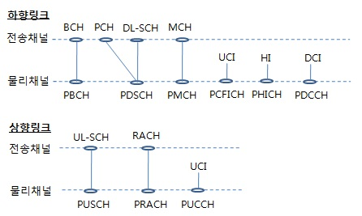
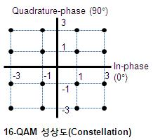

# NW-study

## Network 기본
 - [데이터 전송과정](https://slenderankle.tistory.com/228)
 - [대역폭(BW; BandWidth)](https://blog.naver.com/on21life/221340548735)
   - 특정 기능을 수행할 수 있는 주파수의 범위(Hz 단위)
   - 신뢰성 있는 통신의 자료 전송률(data rate)은 통신을 위해 쓰이는 신호의 주파수 범위에 밀접하게 비례
     - 네트워크 대역폭(Network BandWidth)
     - 데이터 대역폭(Data BandWidth)
     - 디지털 대역폭(Digital BandWidth)
 - 유선 통신 => 무선 통신 => 모바일 통신
   - 단말(UE) <==> (Access Network) <==> (Core Network) <==> 인터넷
   - 유선 통신 : 단말과 Access Network 간에도 물리적인 케이블로 연결됨
   - 무선 통신 : 단말과 Access Network 간에 Air를 통해 연결됨
   - 모바일 통신 : 무선 통신에 이동성이라는 특성이 추가
 - Access Network
   - 서로 알 수 없는 두 디바이스(기지국, UE)간에 유의미한 데이터를 주고 받는 행위
   - 무선, 모바일 통신은 주파수를 이용함
     - Core로부터의 디지털 신호를 아날로그 신호로 변환하여 Air를 통해 UE로 전달
     - UE로부터의 아날로그 신호를 디지털 신호로 변환하여 유선망을 통해 코어로 전달
   - 약속된 수식(?)을 공유하고, 해당 수식에 들어가는 값들만 서로 전달하여 규약에 대한 리소스 소모를 최소화 함 
   - 단말과 연결되는 기지국에서부터 코어로 들어가기 전까지의 중계기까지의 범위
 - Core Network
   - 단말(가입자) 인증 및 이동성 관리
   - 단말의 트래픽을 인터넷으로 연결
   - Access Network로 부터의 데이터를 받는 Gateway부터 Internet으로 들어가기 전까지의 범위

## 주파수(Hz)
 - 전파가 1초 동안 주기적인 현상(진동)이 몇 번 발생하는가?
 - 주파수 구성
   - 주기(s) : 1번의 현상이일어나는데 걸리는 시간(1/f = s)
   - 진폭 : 주파수의 크기
   - 위상 : 0초일때, 주기가 처음 시작하는 위치
 - 같은 주파수라도 진폭과 위상에 따라 다른 신호로 구분할 수 있음
 - 0초에서 (1/주파수)초 동안에 들어온 신호를 봤을 때, 아래 세 신호는 다 다르게 들어옴
   - <0>  진폭 : B      &  위상 : C
   - <1>  진폭 : B      &  위상 : C + 90º
   - <2>  진폭 : B×2  &  위상 : C
 - 따라서, 하나의 주파수에서 진폭과 위상으로 데이터를 신호로 구성하여 전달할 수 있음 
 - 위의 경우는 3개의 다른 신호를 3개의 데이터로 Mapping
 - 즉, 3개의 데이터를 2개의 bit를 이용하여 00, 01, 10의 디지털 신호와 Mapping
 - 주파수는 한정된 자원
   - 주파수가 낮을 수록 멀리까지 잘 보낼 수 있음
   - 주파수가 높을 수록 멀리 보내긴 힘듦
   - 대신, 주파수가 높아 동일한 시간동안 더 많은 진동현상을 확인할 수 있어, 더 많은 데이터를 주고 받을 수 있음

## 장비
 - CN(Core Network) : 과금 등의 서비스 정책 처리 단
 - [4G C-RAN 구조(Centralized/Cloud-Radio Access Network; CU + DU)](https://ko.wikipedia.org/wiki/무선_접속_네트워크)
   - BBU(BaseBand Unit == Digital Unit)
     - RRC, PDCP, RLC, MAC, PHY
   - RRH(Remote Radio Head ~vs Radio Unit~)
     - RF
   - CN --- BBU --- (CPRI) --- RRH
   - |<-백홀->|<--- 프론트홀 --->|
   - Function Split으로 CU와 DU로 나눠짐 [참고](https://www.netmanias.com/ko/post/blog/13093/5g-c-ran-fronthaul-lte-sdn-nfv/5g-ran-and-fronthaul-architectue-function-split-and-open-fronthaul-interface)

 - 5G Function Split
   - 5G에서 massive MIMO와 넓은 대역폭으로 인한 데이터 속도 증가 상황을 고려하여 4G에서의 DU와 RU 분리 위치보다 더 상위 계층에서 분리
   - CU(Central Unit ~vs Control Unit~)
     - RRC, PDCP
   - DU(Distributed Unit)
     - RLC, MAC, PHY-High
   - RU(Remote Unit ~vs Radio Unit~)
     - PHY-Low
     - RF
   - CN --- CU --- DU --- (eCPRI) --- RU
   - |<--- 백홀 --->|<--- 프론트홀 --->|
 - Below 6G Radio Product
   - MMU(Massive MIMO Unit)
     - 안테나 포함
   - RRU(Remote Radio Unit)
     - 안테나 미포함
 - Above 6G Radio Product
   - mmWave AU
     - DU, RU, 안테나 포함
   - mmWave RU

 - FSU(Fronthaul Switch Unit) 
   - CPRI, eCPRI 간의 호환성 맞춰주기 위한 장치
 - UE(User Equipment)
   - 단말기

 - S-eNB: 단말기가 현재 연결되어 있는 기지국, Serving eNB
 - T-eNB: 단말기가 핸드오버로 옮겨갈 기지국, Target eNB
 
  
## 데이터 전송
 - [CP(Cyclic Prefix)](http://www.ktword.co.kr/abbr_view.php?m_temp1=3164)
   - 유효 심볼구간의 마지막 구간의 신호를 복사하여 앞에 삽입
 
 - [User Plane vs Control Plane](https://m.blog.naver.com/ykryu7/221300314804)
   - User Plane(U-Plane)
     - 보이스톡 상황에서, 직접적인 통화 데이터를 칭함
   - Control Plane(C-Plane)
     - 보이트톡 상황에서, 통화를 제어하는데 사용되는 것을 칭함
     - 통화 시작, 종료, 통화 연결을 유지하느데 사용되는 데이터 전송 정보
     - 데이터 사용량을 위해 과금 서버에 보이스톡 통화정보를 기록해야함
     - 통화 중, 기지국 커버리지 반경을 벗어날 경우 핸드오버를 해야함
     - 과금, 위치정보등록, 로밍콜 연결, 부재중 서비스, 콜포워딩, 음성사서함, 유선전화와 핸드폰간의 통화, 국제전화 등 다양한 서비스들을 위해 수많은 서버들과 데이터를 주고 받음

 - [전송채널, 물리채널, 물리제어정보 간에 매핑](http://www.ktword.co.kr/abbr_view.php?m_temp1=5179&m_search=PHY)
 
   
   
 - 물리 데이터 전송용 채널 (Physical Data Channel)
   - 하향 링크(Down Link, ~~RX~~)
      - PBCH (Physical Broadcast Channel)
      - PDSCH (Physical Downlink Shared Channel)
      - PMCH (Physical Multicast Channel)
   - 상향 링크
      - PUSCH (Physical Uplink Shared Channel)
      - PRACH (Physical Random Access Channel)
      
 - 물리 제어 전송용 채널 (Physical Control Channel)
   - 하향 링크
      - PCFICH (Physical Control Format Indicator Channel)
      - PHICH (Physical Hybrid ARQ Indicator Channel)
      - PDCCH (Physical Downlink Control Channel)
      - R-PDCCH (Relay Physical Downlink Control Channel)
   - 상향 링크
      - PUCCH (Physical Uplink Control Channel)
      
 
## [Modulation](http://www.ktword.co.kr/abbr_view.php?id=229&m_temp1=5215&nav=2)
 - AKS(Amplitude Shift Keying)
   - 진폭을 다르게 하며 신호를 구분
 - FSK(Frequency Shift Keying)
   - 주파수를 다르게 하여 신호를 구분
 - PSK(Phase Shift Keying)
   - 위상을 다르게 하여 신호를 구분
   - BPSK(Binary)
      - 두개의 신호를 구분하기 위해 2개의 위상 변조
      - 0도, 180도
   - QPSK(Quadrature)
      - 네개의 신호를 구분하기 위해 4개의 위상 변조
      - 0도, 90도, 180도, 270도 또는 45도, 135도, 225도, 315도
 - [QAM(Quadrature Amplitude Modulation)](http://www.ktword.co.kr/abbr_view.php?m_temp1=1582)
   - PSK(위상변조)에서 ASK(진폭변조)를 추가한 형태, 
   - 복소수로 표현 가능 : Real value(실수)와 Imaginal value(허수)
   - 8QAM
      - QPSK에 진폭변조를 통해 QPSK를 추가한 형태
   - 16QAM

## [데이터 전송 방식](https://m.blog.naver.com/withminit/220724251185
 - FDD(Frequency Division Duplexing)
   - Uplink와 Downlink를 동시에 전달 가능
   - 주파수를 나눠서 사용한다는 관점에서 라디오 채널과 비슷함
   
 - TDD(Time Division Duplexing)
   - Uplink와 Downlink를 주어진 시간에만 전달 가능
   - 시간을 나눠서 사용한다는 관점에서 무전기 원리와 비슷함

## [Waveform](https://guslabview.tistory.com/159)
 - Multiple Access :  다수의 단말 이 자원을 공유하여 접속하는 방식
 - [FDMA(Frequency Division Multiplex Access)](http://www.ktword.co.kr/abbr_view.php?m_temp1=806)
   
 - [TDMA(Time Division Multiplex Access)](http://www.ktword.co.kr/abbr_view.php?m_temp1=348&id=911)
   
 - [CDMA(Code Division Multiplex Access)](http://www.ktword.co.kr/abbr_view.php?nav=&m_temp1=253&id=386)

 - [OFDM(Orthogonal Frequency Division Multiplexing)](http://www.ktword.co.kr/abbr_view.php?m_temp1=2163)
   - 고속의 송신 신호를 수백개 이상의 직교(Orthogonal)하는 협대역 부 반송파(Subcarrier)로 변조시켜 다중화하는 방식 
 - [참고](https://m.blog.naver.com/anniy7/220616369420)
 - [참고2](http://www.ktword.co.kr/abbr_view.php?m_temp1=403)

## 연결
 - [MIMO(Multiple Input Multiple Output)](https://www.ni.com/ko-kr/innovations/white-papers/14/5g-massive-mimo-testbed--from-theory-to-reality--.html)
   - 송수신 기지국(BTS; Base Transceiver Station)에서 다량의 안테나(64개 이상)를 사용하여 무선 데이터 속도와 링크 안정성 향상
   - 페이딩 영향 감소, 대용량, 고속, 커버리지 증대 등의 효과를 얻는 다중 안테나 기술

## 검증
 - [LDPC(Low Density Parity Check Code)](https://medium.com/quantum-ant/ldpc-9de5241ee51e)
   - 네트워크에서 오류를 검출 또는 수정
   - <b>패리티 방식에 필요한 요소</b> : Overlapping 방식, 빠른 패리티 연산, 긴 메세지에도 적용 가능 + 모든 오류 검출 가능한 효율적인 패리티 방식이 필요
   - 저밀도 패리티 체크 등장
     - Parity Check Set가 담당하는 면적, 즉 밀도를 낮추자 => 세트에 해당하는 비트를 무작위로 선택
    
## 용어
 - [RRC(Radio Resource Control)](http://www.ktword.co.kr/abbr_view.php?m_temp1=5175&m_search=RRC)
   - 무선 자원 제어
 
 - [SDAP(Service Data Adaptation Protocol)]()
   - 유･무선 구간사이에 발생하는 디커플링을 완충하기 위한 새로운 무선 계층
   
 - [PDCP(Packet Data Convegence Protocol)](http://www.ktword.co.kr/abbr_view.php?m_temp1=5178&m_search=PDCP)
   - IP 헤더 압축 및 압축 해지, 사용자 데이터의 전송, Radio Bearer에 대한 시퀀스 번호 유지
   
 - [RLC(Radio Link Control)](http://www.ktword.co.kr/abbr_view.php?m_temp1=5169&m_search=RLC)
   - 패킷의 단편화; 상위 PDCP 계층으로부터의 패킷 크기를 MAC 계층 크기로 맞추어 데이터 전달
   
 - [MAC(Media Access Control)](http://www.ktword.co.kr/abbr_view.php?m_temp1=400&id=455&nav=2&m_search=MAC)
   - 여러 단말들의 `공유 매체(Shared Medium)` 사용에 대해 단말 간 충돌/경합 발생을 제어하는 방식

 - [PHY(Physical Layer)](http://www.ktword.co.kr/abbr_view.php?m_temp1=5179&m_search=PHY)
   - 주파수 변조, 코딩, 물리계층 HARQ 처리, 다중 안테나 처리, 신호의 시간-주파수 자원에의 매핑, 전송채널을 물리채널로의 매핑 등
   - 전송 채널, 물리 채널, 물리 제어 정보 간에 매핑
 
 - TX(Transmit Data) : 데이터 전송을 의미
 - RX(Receive Data) : 데이터 수신을 의미
   - 기지국, 단말 모두 두 단자를 모두 가지고 있어 기지국이 TX 소자에서 데이터를 전송하면 단말은 RX 소자에서 데이터를 수신, 그 반대도 마찬가지
   - FDD 방식에서는 두 소자가 반드시 분리되어야 할 듯(?)
   

 - MME: Mobility ManagemEntity
 - SGW: Serving Gateway

 - [프론트홀(Fronthaul)](http://terms.tta.or.kr/dictionary/dictionaryView.do?word_seq=166872-3)
   - 프론트홀(fronthaul) 링크는 주로 고속의 광케이블 등으로 구성되며  동위상/직교 데이터(I/Q data: In-phase and Quadrature data) 를 전달
   - 인터페이스 표준
      - 일반 공용 무선 인터페이스(CPRI: Common Public Radio Interface)
      - 오픈 무선 장치 인터페이스(ORI: Open Radio Equipment Interface)
      - 오픈 기지국 구조 이니셔티브(OBSAI: Open Base Station Architecture Initiative) 
   
## 기타
 - [참고](www.wlanpedia.org › Home › Technology)
